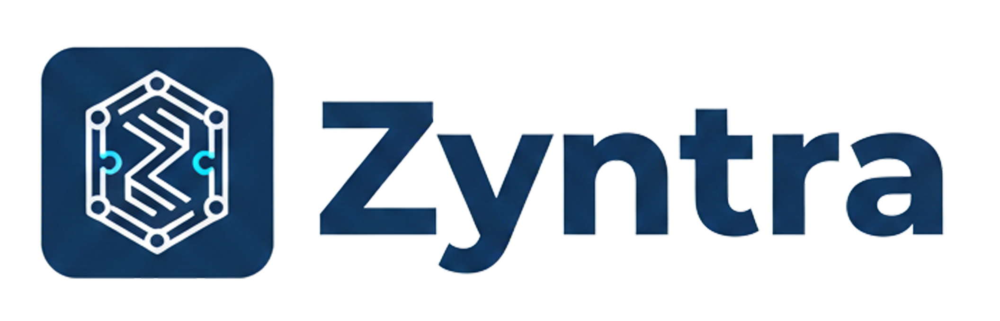

<p align="center">
  
</p>

<h1 align="center">Zyntra ERP</h1>

<p align="center">
  <strong>Plataforma ERP industrial SaaS — Node.js · MySQL · Socket.IO · PWA</strong>
</p>

<p align="center">
  
  
  
  
  
  
  
  
</p>

<p align="center">
  <a href="https://aluforce.api.br">🌐 Demo ao vivo</a> · <a href="mailto:ti@aluforce.com.br">📧 Contato</a>
</p>

---

## O que é o Zyntra ERP?

O **Zyntra ERP** é uma plataforma ERP SaaS **completa e em produção** para indústrias e empresas de médio porte, desenvolvida do zero com stack moderna. Cobre **todo o ciclo operacional** — do pedido de venda à emissão de NF-e fiscal, do chão de fábrica ao financeiro — em uma única plataforma multi-tenant.

> Sistema em produção ativo com clientes reais desde janeiro de 2026.

---

## Por que este projeto se destaca?

| | |
|---|---|
| 🏗️ **Arquitetura real** | Multi-tenant SaaS com isolamento por empresa, JWT + refresh tokens, ACL granular por módulo |
| 🧾 **Integração fiscal** | Emissão de NF-e/NFS-e via SEFAZ, CNAB 240 remessa/retorno, PIX, boleto |
| 💬 **Chat corporativo** | Zyntra Teams: canais, DMs, áudio, arquivos, emojis, status — tudo em Socket.IO |
| 🤖 **IA integrada** | BOB I.A. assistente virtual em todas as telas, + fila de automações n8n |
| 📱 **Mobile nativo** | App Android via Capacitor com splash screen, ícones adaptativos e push notifications |
| 🔒 **Segurança enterprise** | CSRF, rate limiting Redis, XSS prevention, bcrypt, LGPD/PII encryption |
| 📊 **72+ relatórios** | Vendas, Financeiro, PCP, NF-e, Faturamento, Compras, RH |
| 🚀 **CI/CD** | Deploy automatizado para VPS via PM2, scripts de sync, backups diários |

---

## Módulos

| Módulo | Cobertura | Destaques |
|--------|-----------|-----------|
| 📊 **Dashboard** | KPIs executivos, gráficos, alertas em tempo real | Multi-empresa, top vendedores, saúde financeira |
| 🛒 **Vendas** | Pedidos, orçamentos, kanban, comissões, tabelas de preço | Autocomplete produtos, PDF automático, pipeline visual |
| 📦 **Compras** | Requisições → cotações → pedidos → entrada de notas | QR Code estoque, aprovações, avaliação de fornecedores |
| 🏭 **PCP** | Ordens de produção, apontamentos de mão de obra | Import/export Excel, central de relatórios unificada |
| 💰 **Financeiro** | C/P, C/R, CNAB 240, fluxo de caixa, DRE, conciliação | Integração bancária, boleto, PIX, CNAB remessa/retorno |
| 👥 **RH** | Funcionários, folha, ponto eletrônico, férias | Import ponto (Control iD), eSocial, LGPD |
| 🧾 **NF-e / NFS-e** | Emissão fiscal completa via SEFAZ | Manifestação, importação XML, espelho, cancelamento |
| 📦 **Estoque** | Inventário, movimentações, QR Code | Estoque crítico, rastreabilidade, requisições |
| 🏢 **Clientes** | Cadastro completo, análise de crédito | Histórico de compras, limite de crédito, grupos |
| 📞 **Logística** | Romaneio, expedição, rastreamento de entregas | SLA, tipos de entrega, transportadoras |
| ⚙️ **Config SaaS** | 50+ categorias de configuração por tenant | Impostos, certificados, integrações, permissões |

---

## Stack Técnica

### Backend
```
Node.js 18 + Express 4     REST API · middleware JWT · upload Multer
MySQL 8 + mysql2/promise   Transações · migrations · multi-tenant
Socket.IO 4                Chat em tempo real · notificações push
PM2                        Clustering · auto-restart · logs
n8n                        36+ automações: cobranças, relatórios, alertas
```

### Frontend
```
HTML5 + CSS3 (design system proprietário)   85+ páginas com dark theme profissional
JavaScript vanilla                          Sem frameworks — performance máxima
Chart.js                                    Gráficos executivos e operacionais
Socket.IO Client                            Chat e notificações real-time
PWA + Service Worker                        Funciona offline com background sync
```

### Mobile
```
Android (Capacitor 8)      App nativo com splash, ícones adaptativos, push notifications
APK debug                  4.56 MB · conectado a aluforce.api.br
```

### Infraestrutura
```
VPS Ubuntu 22.04   Nginx reverse proxy · Let's Encrypt SSL
Redis              Rate limiting · cache de sessão
Docker             docker-compose.yml para ambiente local
GitHub             Branch strategy · deploy automatizado
```

---

## Integrações Ativas

| Integração | Descrição |
|------------|-----------|
| 🏦 **Open Finance / Bancário** | Boletos, CNAB 240 remessa/retorno, PIX, webhooks bancários |
| 📧 **SMTP** | Emails transacionais, relatórios automáticos |
| 📱 **WhatsApp Business** | Mensagens, notificações de pedidos e cobranças |
| 🧾 **SEFAZ** | NF-e / NFS-e em produção |
| 🤖 **OpenAI** | BOB I.A. (assistente virtual) |
| 🔄 **n8n** | 36+ workflows de automação (cobranças, alertas, backups, relatórios) |

---

## Zyntra Teams — Chat Corporativo

Chat empresarial em **Socket.IO** embutido em todas as 85+ páginas:

- Canais de equipe com controle de admin
- DMs com status online, recentes e pesquisa
- BOB I.A. assistente 24/7
- Áudio, arquivos, imagens, emojis (200+)
- Indicadores de digitação em tempo real

---

## Arquitetura Multi-Tenant (SaaS)

```
empresas_tenant          Plano, trial 14 dias, status
usuarios_empresas        Vínculo N:N usuário ↔ empresa
middleware/empresa.js    Contexto de tenant extraído do JWT por requisição
JWT + refresh tokens     Autenticação com rastreamento completo de sessões
ACL granular             Permissões por módulo e função (admin, gerente, vendedor…)
```

---

## Landing Page & Onboarding

7 páginas estáticas em `/lp/` com fluxo self-service:

1. Cadastro multi-step → `POST /api/onboarding`
2. Backend cria tenant + admin + vínculo em transação única
3. Trial de 14 dias ativo imediatamente
4. Redirect para `/login.html?welcome=1` com toast de boas-vindas
5. Modal automatizado de trial expirado com CTA para comercial

---

## Segurança

- JWT com refresh tokens e rotação automática
- bcrypt para senhas · CSRF tokens · Rate limiting Redis
- XSS prevention · sanitização de inputs
- LGPD: módulo de criptografia PII (`lgpd-crypto.js`)
- Audit trail: todas as ações registradas
- Perfis: admin · gerente · vendedor · comprador · financeiro · producao · visualizador

---

## Automações n8n (36 workflows)

Workflows visuais com dashboard, logs, retry e notificações:

| Categoria | Exemplos |
|-----------|---------|
| 💰 Financeiro | Cobranças automáticas, projeção de fluxo de caixa semanal, retornos bancários CNAB |
| 📦 Operações | Estoque crítico, pedidos atrasados, ordens sem material |
| 👥 RH | Anomalias de ponto, férias vencendo, aniversariantes |
| 🔒 Segurança | Auditoria de anomalias, inativação de usuários inativos |
| 📊 Relatórios | Resumo diário de produção, performance de transportadoras |

---

## Changelog

### v2.4.0 — Março 2026
- ✅ **Android App** — APK nativo via Capacitor 8: splash profissional, ícones adaptativos em todas densidades, push notifications (POST_NOTIFICATIONS, VIBRATE, CAMERA), conectado a aluforce.api.br
- ✅ **Landing Page Profissional** — Reescrita completa (7 páginas) com ícones SVG, onboarding self-service multi-step
- ✅ **Trial 14 dias** — Criação automática de tenant + admin + vínculo em transação única, modal de expiração com CTA
- ✅ **Fix empresa_default_id** — Correção crítica no onboarding multi-tenant
- ✅ **Pricing Sob Consulta** — Planos sem valores fixos (Starter, Profissional, Enterprise)

### v2.3.0 — 27/03/2026
- ✅ **Contas a Receber** — Módulo completo: status dropdown, comprovante de pagamento (upload), simulador PM, aba FUNDOS, 7 novas colunas DB
- ✅ **CNAB 240** — Multi-seleção, geração de remessa .REM, importação de retorno .RET, baixa automática em lote
- ✅ **PCP Unificado** — Central de Relatórios com 5ª aba de apontamentos (KPIs, resumo por funcionário, eficiência)
- ✅ **72+ Relatórios** — Vendas (10), Financeiro (11), PCP (5), NFe (17), Faturamento (17), Compras (6), RH (10)

### v2.2.x — 25/03/2026
- ✅ **Condição de Pagamento** — Modal redesenhado, parcelas calculadas automaticamente
- ✅ **Fix PDF Vendas** — Erros de geração de PDF corrigidos
- ✅ **QR Code Estoque** — Sistema de entrada/saída via QR Code no celular
- ✅ **Permissões logística** — Cards corretos por perfil de acesso

### v2.1.x — Jan/Fev 2026
- ✅ **NF-e completa** — Emissão, manifestação, importação XML via SEFAZ
- ✅ **PCP** — Ordens de produção com import/export Excel
- ✅ **Conciliação Bancária** — OFX/CNAB e conciliação automática
- ✅ **Chat Teams** — BOB I.A., canais, DMs, áudio, arquivos, 85+ páginas
- ✅ **Segurança** — Refresh tokens, CSRF, rate limiting Redis, LGPD, audit 53/53

---

## Contato

| Canal | |
|-------|--|
| 🌐 **Demo** | [aluforce.api.br](https://aluforce.api.br) |
| 📧 **Email** | ti@aluforce.com.br |
| 📱 **Telefone** | (11) 96239-7527 |

---

<p align="center">
  Software proprietário · <strong>Agência do Japa</strong> · 2026
</p>
